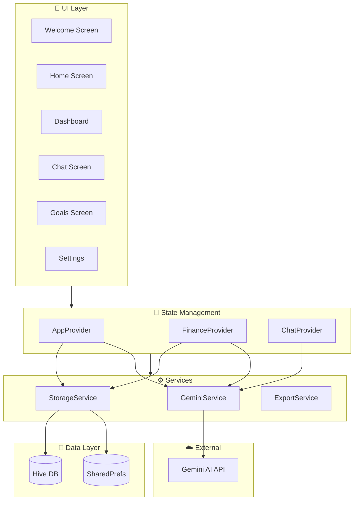
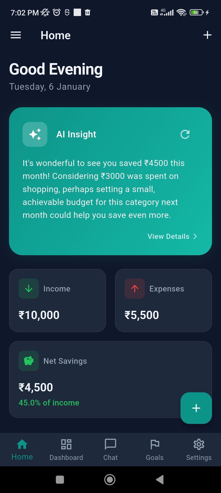
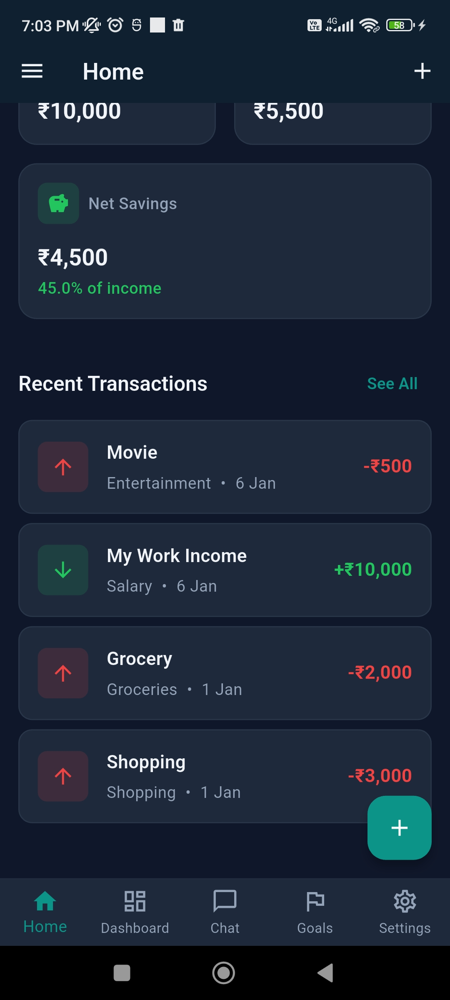
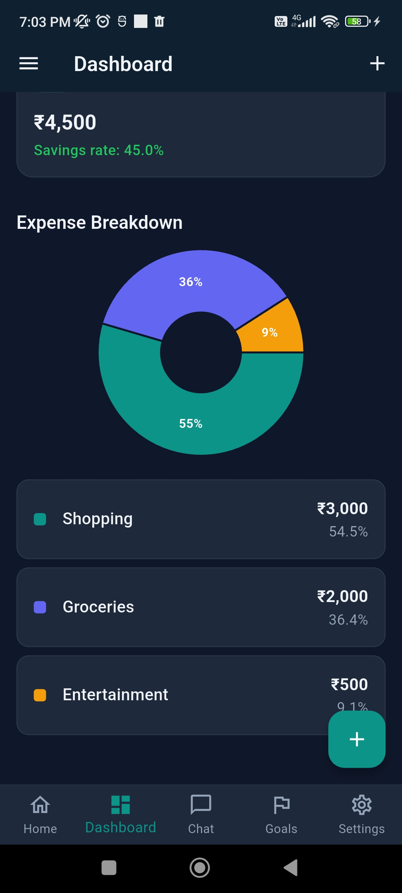
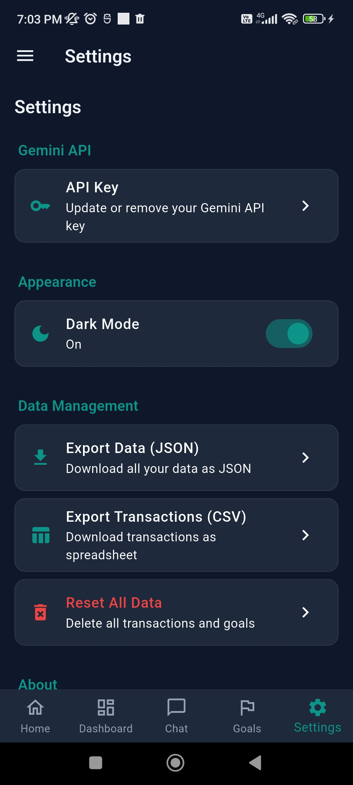
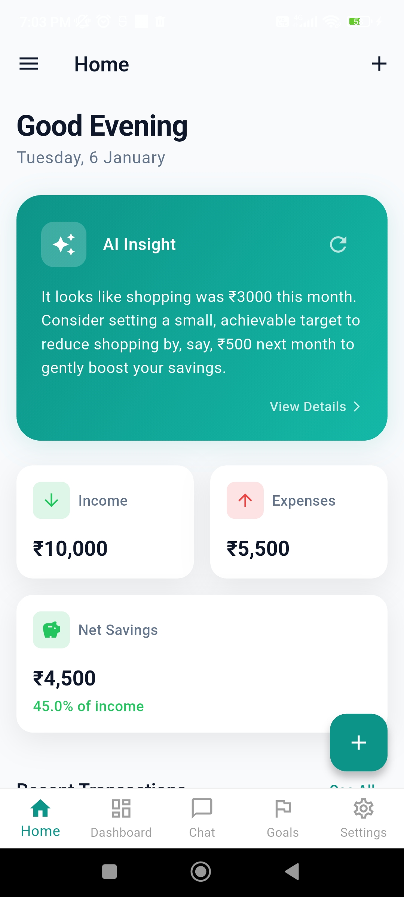
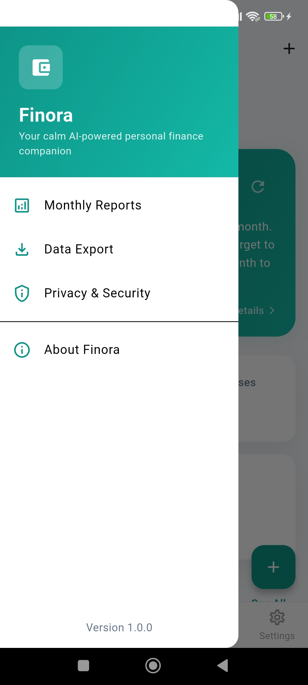

<div align="center">

# 💰 Finora

### Your Calm AI-Powered Personal Finance Companion

[](https://flutter.dev)
[](https://ai.google.dev/)
[](LICENSE)


---

**Privacy-first • No accounts required • Your data stays local**

</div>

---

## 🚧 Project Status

<div align="center">

</div>

> **This repository is actively under development!**
> 
> We're building the MVP version of Finora. Features are being added regularly.
> Contributions, suggestions, and feedback are warmly welcomed! 🙌

---

## ✨ Features

| Feature | Status |
|---------|--------|
| 🔑 API Key Entry (Optional) | ✅ Completed |
| 🏠 Home Dashboard | ✅ Completed |
| 📊 Expense Tracking | ✅ Completed |
| 🎯 Goal Planning | ✅ Completed |
| 💬 AI Chat Assistant | ✅ Completed |
| 📈 Monthly Reports | ✅ Completed |
| 🌙 Dark/Light Theme | ✅ Completed |
| 📤 Data Export | ✅ Completed |
| 🤖 Auto Model Detection | ✅ **NEW** |
| 🔔 Notifications | 🚧 Coming Soon |
| 📱 Bank Sync | 🚧 Planned |

---

## 🤖 Smart AI Model Detection

Finora automatically detects and uses the best available Gemini model for your API key:

```
Gemini 3 → Gemini 2.5 → Gemini 2.0 → Gemini 1.5 → Legacy
```

**Supported Models:**
- `gemini-3-pro-preview`, `gemini-3-flash-preview`
- `gemini-2.5-flash`, `gemini-2.5-pro`
- `gemini-2.0-flash`, `gemini-2.0-flash-lite`
- `gemini-1.5-flash`, `gemini-1.5-pro`
- `gemini-pro`, `gemini-1.0-pro`

No manual configuration needed - the app finds what works! 🎉

---

## 🛠️ Tech Stack

<div align="center">

| Technology | Purpose |
|------------|---------|
| **Flutter** | Cross-platform UI |
| **Dart** | Programming language |
| **Gemini AI** | Financial insights & chat |
| **Hive** | Local database |
| **Provider** | State management |
| **fl_chart** | Beautiful charts |

</div>

---

## 🏗️ Architecture



<div align="center">

**Data Flow**: UI → Providers → Services → Local Storage / Gemini API

</div>

---

## 🚀 Getting Started

### Prerequisites

- Flutter SDK (^3.10.4)
- Dart SDK
- A [Gemini API Key](https://aistudio.google.com/app/apikey) *(optional - app works without it)*

### Installation

```bash
# Clone the repository
git clone https://github.com/AditthyaSS/Finance.ai.git

# Navigate to project
cd Finance.ai

# Install dependencies
flutter pub get

# Run the app
flutter run
```

> 💡 **Tip:** You can explore the app without an API key! Add one later in Settings to unlock AI features.

---

## 🤝 Contributing

**Contributions are welcome and appreciated!** 🙌

1. Fork the repository
2. Create your feature branch (`git checkout -b feature/AmazingFeature`)
3. Commit your changes (`git commit -m 'Add some AmazingFeature'`)
4. Push to the branch (`git push origin feature/AmazingFeature`)
5. Open a Pull Request

### Ways to Contribute

- 🐛 Report bugs
- 💡 Suggest new features
- 📖 Improve documentation
- 🎨 Enhance UI/UX
- 🔧 Fix issues

---

## 🔒 Privacy

Finora is **privacy-first**:

- ✅ All data stored locally on your device
- ✅ No accounts or sign-ups required
- ✅ API key stored securely on device
- ✅ No analytics or tracking
- ✅ No data sent to our servers
- ✅ Works offline (except AI features)

---

## 📸 Screenshots

<div align="center">












</div>

---

## 📜 License

This project is licensed under the MIT License - see the [LICENSE](LICENSE) file for details.

---

<div align="center">


### Made with ❤️ by Aditthya

**⭐ Star this repo if you find it useful!**

[](https://github.com/AditthyaSS/Finance.ai)

</div>
